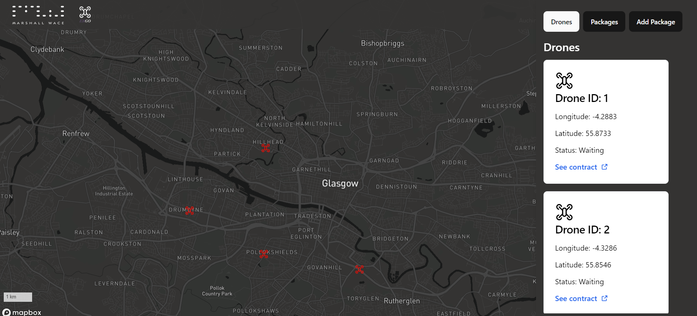
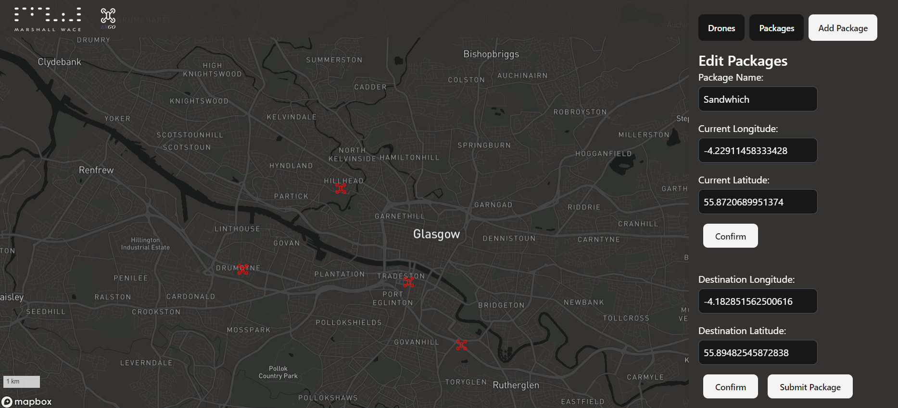
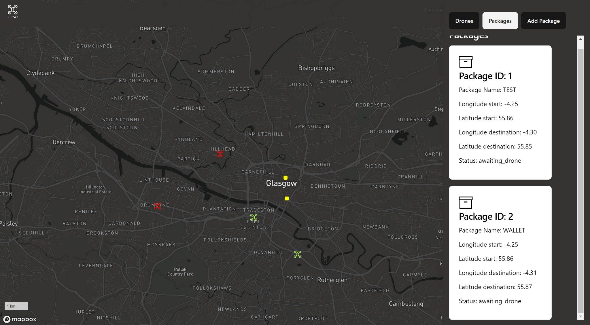

# Ergo

  

Ergo is a blockchain-based drone management application. Users can to deliver packages to any location within Glasgow and track drone locations and deliveries in real-time.

---

- **Hackathon**: [Do You Have The GUTS?]([https://hackathon-link.com](https://fixr.co/en-US/event/do-you-have-the-guts-2024-tickets-421119342))
- **Date**: 12/10/2024 - 13/10/2024
- **Team Members**:
  - [Connor Coull](https://github.com/ConnorCoull)
  - [Cammy Craig](https://github.com/cammycraig)
  - [Cameron Early](https://github.com/DastardlySky)
  - [Joanna Jardine](https://github.com/epicjoanna)
  - [Ashleen Daly](https://github.com/ashleendaly) 

---

## 🧑‍💻 Technologies Used

- **Frontend**: Typescript, React, Tailwind, Mapbox
- **Backend**: Python, FastAPI, Web3.py, Twilio
- **Blockchain**: Ethereum, Solidity

---

## 🚀 Getting Started

### Prerequisites

- Node.js
- uv
- crypto wallet with minimum 0.002 Sepolia Testnet ETH.

#### Frontend

```bash
cd frontend
```

You will need a valid Mapbox API key inside `.env`:

```bash
VITE_REACT_APP_MAPBOX_ACCESS_TOKEN = ""
```

Install dependencies and run the development instance:

```bash
npm i
npm run dev
```

#### Backend

```bash
cd backend
```

You will need a valid Infura API key and a crypto wallet private key:

```bash
INFURA_API_KEY=""
PRIVATE_KEY=""
```

Where `PRIVATE_KEY` is the private key of your crypto wallet containing the sufficient SepoliaETH funds.

Install dependencies and run the development instance:

```bash
uv sync
cd src
uv run uvicorn main:app --reload --port 8080
```

---

## 📚 How to Use

### View Drones

The follow is Ergo's landing page, where you can view all active drones in Glasgow by scrolling through the sidebar on the right or viewing their position on the map.
Drones are red is they are waying for a package to be requested, and green if they are currently deliverying a package.



### Add Package

To add a package, navigate to the form by clicking on the "Add Package" button. Then fill in the form by typing in the current and destination latitude and longitudes or clicking the positons on the map.



### View Packages

Then watch as the nearest drone picks up the package and delivers it to its destination.



---

## 📜 License
This project is licensed under the MIT License - see the [LICENSE](LICENSE) file for details.
